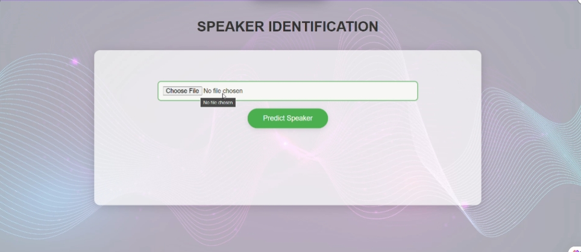

# IDENTIFICATION DU LOCUTEUR ENTRE MODLE TRADITIONNEL ET REVOLUTIONNEL BASE SUR LE DL

Ce projet explore différentes stratégies d’identification du locuteur, combinant des approches classiques d’apprentissage automatique et des modèles profonds. L’objectif est d’évaluer la performance de plusieurs modèles pour reconnaître des locuteurs à partir de courts extraits audio, allant de méthodes traditionnelles à des modèles hybrides ou séquentiels.

## Jeux de Données

### EmoDB (Emotional Speech Database)
- Corpus émotionnel en allemand.
- 10 locuteurs avec différentes émotions.
- Utilisé pour l’identification à petite échelle, influencée par l’émotion.

### 50 Speakers Audio Data (Kaggle)
- Base de données contenant 50 locuteurs distincts.
- Enregistrements propres, adaptés aux modèles profonds.

## Modèles Étudiés

### GMM (Gaussian Mixture Models)
- Entraînés sur les MFCC pour chaque locuteur.
- Sert de modèle de référence (baseline).

### Modèles de Deep Learning

#### CNN1D vs CNN2D
- Étude de l’effet de la forme d’entrée :
  - **CNN1D** : les MFCC sont considérés comme des séquences (temps × caractéristiques).
  - **CNN2D** : les MFCC sont traités comme des images.
- **Résultat** : CNN2D surpasse CNN1D grâce à une extraction spatiale plus riche.

#### LSTM
- Motivation : les MFCC sont séquentiels → LSTM capture les dépendances temporelles.
- Entrée : MFCCs en séquence temporelle.

### Modèles Hybrides

#### CNN + GMM
- CNN utilisé pour extraire des embeddings (couche Dense avant la sortie).
- Un GMM est entraîné par locuteur à partir des embeddings.

#### CNN + KNN
- Les embeddings du CNN sont également utilisés par un classificateur KNN.
- **Pourquoi KNN ?** : exploite la séparabilité des embeddings sans hypothèse de distribution.
- **Observation** : efficace si les embeddings forment des clusters distincts.

## Déploiement avec Flask

Une application Flask simple a été développée pour une démonstration de reconnaissance du locuteur en temps réel. L’utilisateur peut téléverser un fichier audio (.wav), et le modèle retourne le locuteur prédit.

### Fonctionnalités :
- Interface de téléversement audio  
- Extraction des MFCC côté serveur  
- Prédiction avec le modèle CNN2D  
- Affichage du nom du locuteur prédit  

---

### Vous pouvez consulter la présentation dans ce lien :
  [[Cliquez ici](https://www.canva.com/design/DAGkz1NCJhQ/8CKwQhID4vG01Lq6bWDQ6g/view?utm_content=DAGkz1NCJhQ&utm_campaign=designshare&utm_medium=link2&utm_source=uniquelinks&utlId=h35383e5990#45)]

